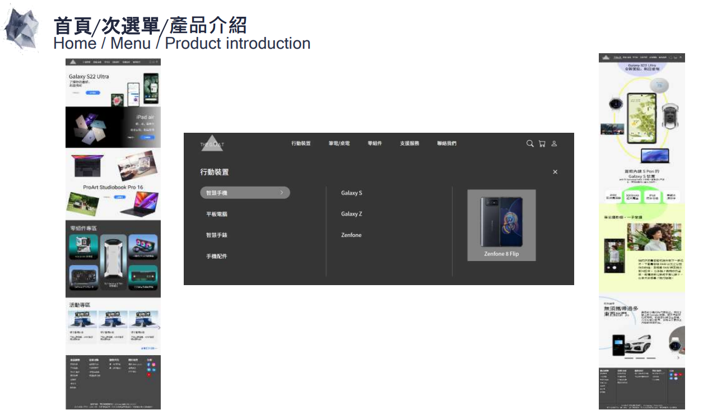
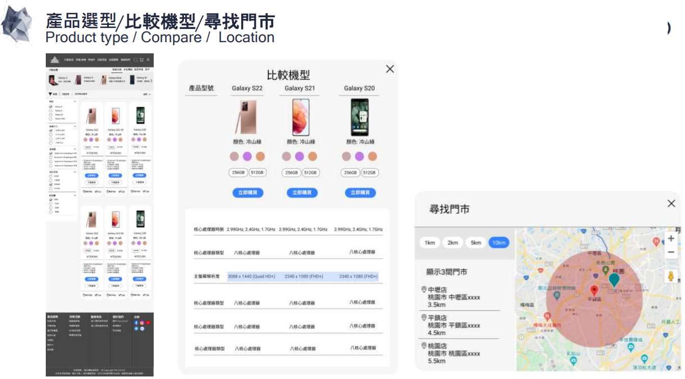
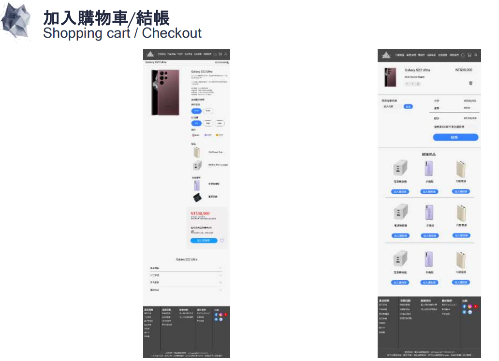
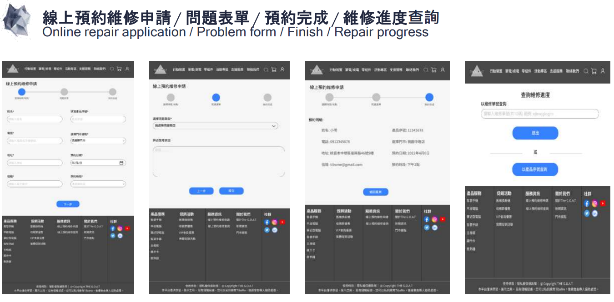
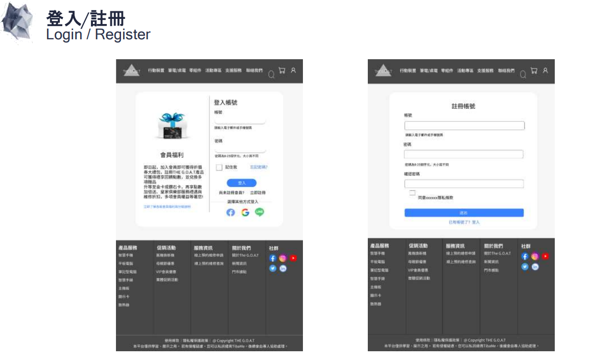

# THE G.O.A.T 史上最強3C硬體設備

網址: https://bill-yeh.github.io/the-goat-3c-website/index.html

這是一個販售3C設備的網站，產品包含智慧型手機、筆記型電腦、桌上型電腦、顯示卡、風扇、智慧型穿戴裝置以及零組件，此外，本網站提供線上維修預約服務，讓消費者能先行預約時間，解決產品問題。

**本網站為RWD響應式設計，支援桌機、平板與行動裝置瀏覽。**

## 使用技術
* HTML
* CSS
* JavaScript
* Jquery
* Git
* AOS
* Owl Carousel

 

## 網站功能與效果
1. Navigation bar
    - 滑鼠hover到文字時，選單由上往下顯示。採用**jquery slideDown()**。
    - 滑鼠hover到文字時，採用**CSS 偽元素 (pseudo-element)**，在文字下方顯示底線並搭配transition和transform，達到伸縮視覺效果。
    - Hover到產品會顯示對應的產品圖片。採用**JavaScript for loop** 顯示對應圖片。
2. Home page
    - 主打商品S22 Ultra 宣傳影片，採用**HTML Video autoplay** 屬性，使影片自動播放。
    - 活動專區採用**Owl Carousel 幻燈片**效果呈現。
3. product-introduction
    - 產品介紹頁面採用**CSS position sticky**，呈現滑鼠向下滑動，手機依舊固定在畫面上方的效果。
    - 此頁面的版面設計具有層次感，讓使用者能感受到產品的新穎性。
    - 下方的產品功能介紹採用**Owl Carousel 幻燈片**效果呈現。
4. choosing-type
    - 整個頁面的版面採用CSS grid system 規劃，左側類別選單比例3，右側產品圖卡區比例9。
    - 頁面載入時，使用AOS 套件的fade 效果，讓產品圖卡緩緩滑入。
    - 點擊顏色變化產品照片並顯示對應顏色，採用**jquery click 事件搭配hide() show()** 切換圖片。
    - 購買地點和比較功能，採用**jquery click 事件搭配hide(),show(),addClass,removeClass** 達到燈箱顯示效果。
5. order-page
    - 產品規格採用input type radio 讓使用者去選取規格。
    - Galaxy S22 Ultra 產品資訊總攬，採用**jquery slideToggle** 呈現資訊向下滑出的效果。
6. online-repair-application
    - 產品序號採用**正規表達式**驗證序號是否為6碼且首字必須式大寫英文。
7. login & register
    - 帳號驗證: **正規表達式**，驗證格式是否為email或手機號碼。
    - 密碼驗證: input type number 設定maxlength="25", minlength="8"
    - 在輸入錯誤格式時，下方會出現紅字提示。

 

## 網站圖片展示

